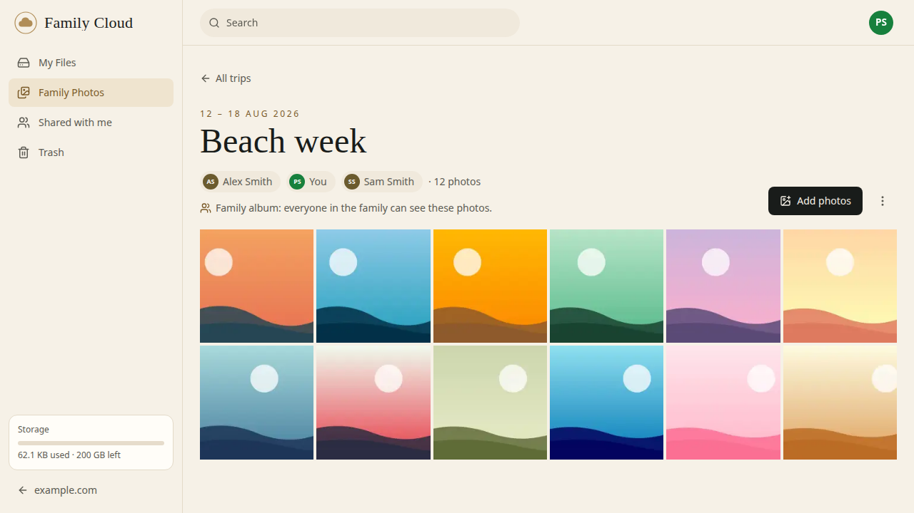
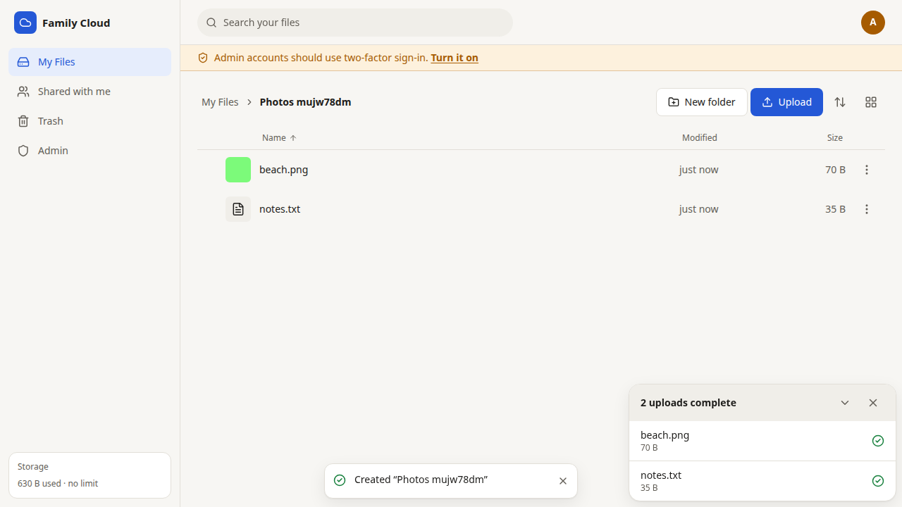
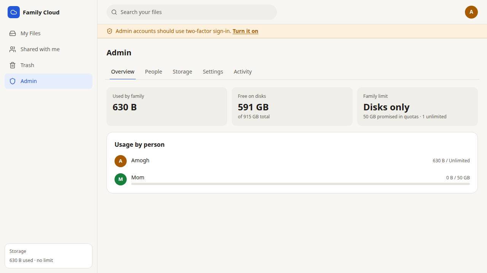
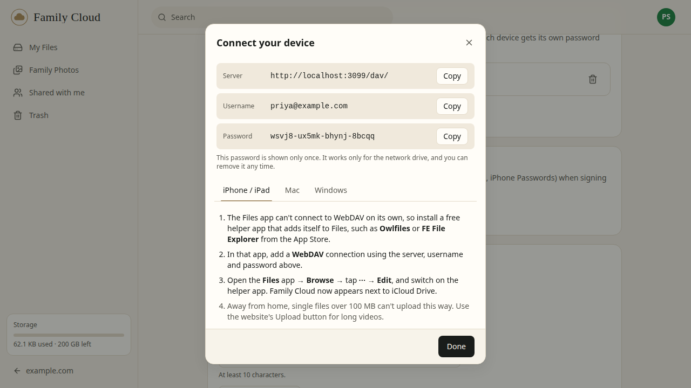
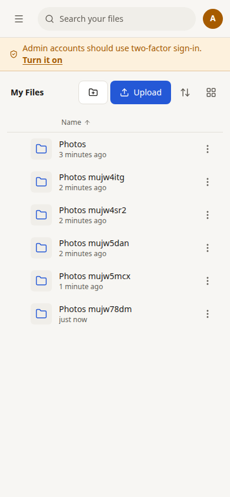

# Family Cloud

Your family's own Google Drive, running on a computer you already have.

Family Cloud turns a Linux machine and its disks into a private cloud for the people you live with. Everyone gets an account, a storage quota you control, and access from any browser, phone or laptop. Files stay in your home, on your disks.



## What it does

- **Private files for everyone.** Each person's **My Files** is theirs alone: nobody else (admins included) can see it unless they share something.
- **Family Photos.** Trip albums for the whole family: give a trip a name, dates and who went, and everyone on it adds photos straight from their phone. Every family member can see every album and filter by person; each person's photos still count against their own storage.
- **Accounts for the whole family.** Invite people with a link. Optionally allow only your family's email domain (e.g. `@smithfamily.com`) to be invited or sign in. Forgotten password? An admin sends a one-time reset link; nobody needs to touch the server.
- **Sign in with Face ID or Touch ID.** Passkeys (synced through iCloud Keychain or Google Password Manager), plus passwords with optional two-factor codes and recovery codes for a lost phone.
- **Upload anything, from anywhere.** Big uploads are sent in pieces, survive a dropped Wi‑Fi connection, and resume where they left off. Drag in whole folders.
- **Photos and videos look right.** Thumbnails for photos (including iPhone HEIC), videos and PDFs. The viewer works like a phone's photo app: swipe between photos, pinch or double-tap to zoom, swipe down to close.
- **Share inside the family** (view or edit), or **with anyone** through a link with an optional password, expiry date and download limit.
- **Ask anyone for files.** A file request link lets people without an account send files into a folder, or photos straight into a trip album. They see an upload page, never your files.
- **Version history.** Save over a file from any device, or choose "Replace" when uploading one that's already there, and what it held is kept for 30 days to download or put back. **Rewind** puts a whole folder back as it was at an earlier moment.
- **Find things fast.** Recent files, Starred, and search that looks inside PDFs, Office documents and text files, and includes what's shared with you. Copying files and folders is instant.
- **A real network drive.** Open your files in macOS Finder or Windows Explorer with nothing to install (WebDAV), and in the iPhone/iPad Files app through a helper app, with a separate revocable password per device.
- **Storage you can see and share out.** The admin screen shows where the space on your disks goes and how the family's space is split between people, and lets you hand out, even out and move allowances. Everyone sees how much space they have left, and a **Free up space** page shows each person their biggest files, files stored twice and old versions.
- **Grow storage by adding disks.** Plug in a new drive and add it from the admin screen, without restarting. Retire an old drive and every file is moved off it and checked first.
- **Optional virus scanning.** Every upload can be checked with ClamAV on your own server; infected files are blocked. Off by default, since it needs about 1.5 GB of memory.
- **Trash with undo**, a 30-day safety net before anything is gone for good.
- **Your family's look.** Upload your own logo (also used as the home-screen icon), choose the word beside it and link back to your family website. Light and dark themes, and it installs to a phone's home screen like an app.
- **Secure and private by default.** Two-factor and passkey sign-in, rate limiting, no open router ports (with Cloudflare Tunnel), uploaded files that can never run code in your browser, no tracking or analytics, and it asks search engines not to list it. A built-in Privacy page tells everyone what's kept and who can see what. See the [security report](docs/security.md).

| Private files | Admin: storage and allowances |
| --- | --- |
|  |  |
| **Network drive setup** | **On a phone** |
|  |  |

## Run your own

**You need** a Linux computer that stays on (a spare PC, a mini PC or a Raspberry Pi 5), and a domain name if your family should reach it away from home. You don't need to know Docker: the installer sets it up.

**1. Install** (about 15 minutes):

```bash
git clone https://github.com/amoghkaja/Self-Hosted-Cloud-Storage.git familycloud
cd familycloud
./scripts/install.sh --install-docker
```

It installs the newest release and asks a few questions: how your family will reach it (a free **Cloudflare Tunnel** with no router changes, your own domain, Tailscale, or "later"), the address, a name and where to keep the files. It generates all the secrets, starts everything and offers to install updates automatically. If it installed Docker, log out and back in, then run `./scripts/install.sh` again.

**2. Create your account.** The installer prints a link and a one-time setup token. Open the link, paste the token and create the admin account.

**3. Invite your family** from **Admin → People**. In **Admin → Settings**, add your logo under Branding, and (if your family shares an email domain) list it under "Only allow these email domains".

**4. Set up backups** before the family relies on it. The installer offers to run `./scripts/backup-setup.sh`: it asks where backups go (another disk, another computer, Backblaze B2 or S3) and schedules them nightly. See [backups](docs/backup-restore.md).

The [self-hosting guide](docs/self-hosting.md) walks through each step, including putting it on your own domain.

### Updating

```bash
./scripts/update.sh
```

It shows what's new, backs up the database, installs the newest release and checks that everything came back. If you turned on automatic updates, this runs every Sunday morning; releases that need you to do something are left for you to run by hand. What changed in each version is in the [changelog](CHANGELOG.md), and **Admin → Overview** shows the version you run.

### Guides

| Guide | What it covers |
| --- | --- |
| [Self-hosting](docs/self-hosting.md) | Hardware, installing, your domain, first sign-in, updating, troubleshooting |
| [Cloudflare Tunnel](docs/cloudflare-tunnel.md) | Putting it on your own domain without opening ports |
| [Disks and storage](docs/storage-and-disks.md) | Allowances, family limit, adding, limiting and retiring disks |
| [Virus scanning](docs/virus-scanning.md) | Optional ClamAV check of every upload; turning it on and off |
| [Network drive](docs/network-drive.md) | Finder, Windows and Linux; iPhone/iPad with a helper app |
| [Backups and moving](docs/backup-restore.md) | Nightly backups, restoring, moving to new hardware |
| [Hardware and uptime](docs/hardware-and-uptime.md) | What to run it on, power use, keeping it online |
| [Versions and releases](docs/releasing.md) | How versions are numbered, update channels, cutting a release |

## How it's built

```
Browser / phone / Finder / Explorer
        │ HTTPS
  Cloudflare Tunnel (or Caddy)
        │
 ┌──────┴──────────────── Docker Compose ─────────────────────┐
 │  app      Fastify API + web app + WebDAV     (Node.js 24)  │
 │  worker   thumbnails, checksums, disk moves, cleanups      │
 │  db       PostgreSQL 18: accounts, folders, job queue      │
 └──────┬─────────────────────────────────────────────────────┘
        │
  /srv/familycloud/volumes/disk1, disk2, …   (your disks)
```

- **Server:** TypeScript, Fastify 5, Drizzle ORM and PostgreSQL. pg-boss runs background jobs, so Redis isn't needed.
- **Web app:** React 19 with Vite, TanStack Query, Radix UI primitives and Tailwind CSS 4.
- **Files:** kept as content blobs spread across your disks; the folder tree lives in the database. Renames and moves are instant, and a file's bytes can move between disks without anything else changing.

The full design (data model, upload protocol, permissions, caching and how it would scale) is in [docs/architecture.md](docs/architecture.md). The HTTP API is documented in [docs/api.md](docs/api.md), and the UI component library in [docs/ui-components.md](docs/ui-components.md).

### Repository layout

```
apps/server/        API, background worker and admin CLI (Fastify, Drizzle, pg-boss)
  src/modules/      auth (incl. passkeys), files, uploads, sharing, photos, admin (incl.
                    branding), webdav: one folder per feature
  src/storage/      disk volumes, placement, thumbnails
  src/jobs/         background jobs (thumbnails, checksums, draining disks, cleanups)
  test/             integration tests against a real PostgreSQL
apps/web/           React app
  src/components/ui reusable, accessible UI primitives
  src/features/     file browser, photos (trip albums), uploads, sharing, admin, settings,
                    public links
packages/shared/    API contract (Zod schemas + types) shared by server and web
deploy/             docker-compose.yml, Caddyfile, .env.example
scripts/            install.sh, update.sh, backup-setup.sh, backup.sh, add-disk.sh, release.sh
docs/               guides and design documents
e2e/                Playwright end-to-end tests
```

## Development

Requires Node.js 24 (`nvm use`) and pnpm. No Docker needed for development: an embedded PostgreSQL runs from the repository.

```bash
pnpm install
cp .env.example .env         # then set SECRET_KEY (openssl rand -hex 32)
pnpm dev:db                  # terminal 1: local PostgreSQL on port 54320
pnpm dev                     # terminal 2: API on :3000 and the web app on http://localhost:5173
pnpm dev:worker              # terminal 3 (optional): thumbnails and background jobs
```

On first start the API log prints a setup token for creating the first account.

| Command | What it does |
| --- | --- |
| `pnpm test` | Unit and integration tests (server tests start their own PostgreSQL) |
| `pnpm typecheck` / `pnpm lint` | TypeScript and Biome |
| `pnpm build` | Production build of the web app and server |
| `pnpm e2e` | Playwright smoke test against a running instance |
| `./scripts/dev-reset.sh` | Stop dev processes and wipe local dev data |

Interactive API docs are served at `/api/docs` in development. See [CONTRIBUTING.md](CONTRIBUTING.md) for conventions.

## Security

Please report vulnerabilities privately; see [SECURITY.md](SECURITY.md). The threat model and the findings of the most recent review are in [docs/security.md](docs/security.md).

## License

Copyright (C) 2026 Amogh Kaja.

Family Cloud is free software under the [GNU Affero General Public License v3.0 or later](LICENSE) (AGPL-3.0-or-later). In plain terms:

- **Use it freely,** at home, for your family, or in your organisation, for free.
- **Change it however you like.** If you only run your changed version for yourself or your family, you don't have to publish anything.
- **If you let other people use a changed version over the network** (for example as a hosted service), you must offer them its source code under the same license. Set `SOURCE_URL` to your fork so the app's "Source code" link points at it.
- **Selling it** (hosting, support, setup) is allowed on the same terms: your changes stay open.

Want to build it into a closed-source or commercial product without those terms? A separate commercial license is available; open an issue to get in touch.
